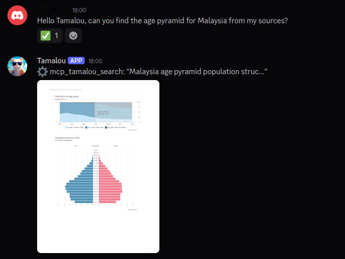

# tamalou-rag-mcp

Modular RAG MCP server with auto screenshots for visual sources (PDFs).
Built for CPU-bound prod boxes with GPU offload for heavy embedding work.



- **ChromaDB** vector store (local, persistent)
- **Granite 97M multilingual** embeddings (FR/EN, CPU-friendly)
- **Auto screenshots** for paginated sources — pages rendered as PNG, perfect for Discord/Slack
- **Modular loaders** — drop a file in `loaders/`, get a new format
- **Incremental** — `add` a single file without rebuilding
- **GPU offload bundles** — embed on a GPU box, ship a `.tar.gz`, import on prod

## Built-in loaders

| Loader        | Format             | Default collection |
|---------------|--------------------|--------------------|
| `pdf`         | `.pdf`             | `guide_pages`      |
| `discord_md`  | DiscordChatExporter `.md` | `tamalou_memory` |
| `text`        | `.txt`             | `tamalou_memory`   |

## Quick start

```bash
git clone <repo>
cd tamalou-rag-mcp
python -m venv venv && source venv/bin/activate
pip install -e .

# Edit config.yaml (paths, port, model)
# Drop sources in data/

tamalou-ingest                       # full rebuild from data/
tamalou-add file.pdf "My Book"       # incremental add
tamalou-server                       # FastAPI on :8702
tamalou-mcp                          # MCP stdio (for Hermes/Claude/etc)
```

## Add a new format

Create `src/tamalou_rag/loaders/<name>.py`:

```python
from .base import Loader, Chunk
from pathlib import Path

class EpubLoader(Loader):
    name = "epub"
    extensions = [".epub"]
    collection = "guide_pages"

    def chunks(self, path: Path, label: str):
        for page_num, text in self.iter_pages(path):
            yield Chunk(
                text=text,
                source=label,
                metadata={"page": page_num, "pdf_filename": path.name},
            )
```

Auto-registered. Add a section to `config.yaml`:

```yaml
loaders:
  epub:
    enabled: true
    chunk_chars: 2000
```

That's it.

## GPU offload workflow

Embedding on CPU is slow (~2 min per 100 pages). For heavy ingestion, do it on
a GPU box and ship a bundle:

```bash
# On the GPU machine — same repo, same config (same embedding model!)
tamalou-add bigbook.pdf "Big Book"
tamalou-export /tmp/bigbook.tar.gz --source "Big Book"

# Copy to prod
scp /tmp/bigbook.tar.gz prod:/tmp/

# On prod
tamalou-import /tmp/bigbook.tar.gz
# → schema check, model match, IDs deduped, source PDFs restored,
#   running server reloaded automatically
# or sudo systemctl restart tamalou-rag if service is setup
```

Bundles are model-locked: import refuses if the embedding model differs between
sender and receiver (otherwise vectors aren't comparable).

`tamalou-export` flags:
- `--collection NAME` — limit to one collection
- `--source LABEL` — only entries with this `source` value (typical use)
- `--ids id1,id2,...` — explicit list
- `--no-pdfs` — skip bundling source PDFs

`tamalou-import` flags:
- `--allow-overwrite` — re-add IDs that already exist (default skips them)

## Removing a document

```bash
tamalou-remove --source "Malaysia Statistics" --dry-run   # preview
tamalou-remove --source "Malaysia Statistics"             # interactive confirm
tamalou-remove --filename Malaysia_Statistics.pdf --yes   # by filename, no prompt
tamalou-remove --source "Old Book" --keep-pdf             # keep file in exports/
```

Removes all matching chunks across collections, deletes the source PDF from
`exports/` (unless `--keep-pdf`), and triggers a server `/reload` so a running
instance picks up the change.

## Migrating an existing ChromaDB

If you have a chroma_db built by an older script that didn't store
`pdf_filename` in metadata, run the one-shot backfill:

```bash
tamalou-migrate --dry-run        # preview what would change
tamalou-migrate                  # apply
```

Point `paths.chroma_db` and `paths.exports` in `config.yaml` at the existing
folders — no re-embedding needed.

## MCP integration (Hermes Agent)

In `~/.hermes/config.yaml`:

```yaml
mcp_servers:
  tamalou:
    command: /path/to/tamalou-rag-mcp/venv/bin/tamalou-mcp
    env:
      TAMALOU_CONFIG: /path/to/tamalou-rag-mcp/config.yaml
```

Tools exposed:
- `search` — semantic search across all collections, returns hits + auto screenshot
  - `query` (required) — search terms
  - `n` — number of results (default: 3)
  - `source` — filter by source name, e.g. `"My Book"`, `"My Book 2"`, `"My Document 0"`
- `add` — incremental ingest of a local path or http URL
- `health` — check server status and document counts per collection

## Running as a systemd service

A template unit file is included at `deploy/tamalou-rag.service`. Edit paths
to match your install, then:

```bash
sudo cp deploy/tamalou-rag.service /etc/systemd/system/
sudo systemctl daemon-reload
sudo systemctl enable --now tamalou-rag.service

# Verify
systemctl status tamalou-rag.service
curl -s http://localhost:8702/health
# → {"status":"ok","collections":{"guide_pages":N,"tamalou_memory":M}}
```

Logs:

```bash
journalctl -u tamalou-rag.service -f
```

## License

MIT
